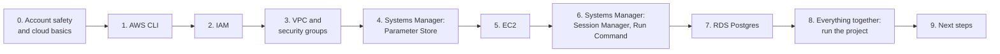

# AWS learning roadmap for this project

This roadmap takes you from "AWS is new to me" to understanding every line in the [`aws/`](..) folder.
It's ordered so each stage only uses ideas from the stages before it. Each stage has:

- **Why**: where the topic shows up in this project.
- **Learn**: the concepts, in reading order, with links to the official docs.
- **Read in the repo**: the project files to read once the concepts make sense.
- **Do**: a hands-on lab in [`examples/`](examples), all written for this roadmap.
- **Check yourself**: questions you should be able to answer before moving on.

Suggested pace: one stage per evening or two, about 2–3 weeks in total. Stages 0–4 cost nothing.

---

## How to learn: the tools

| Tool | What you use it for | Cost |
|---|---|---|
| **Your own AWS account** | Everything. Use a personal account, not a company one. | Free to open. [Free tier and credits for new accounts](https://aws.amazon.com/free/) |
| **AWS Console** (browser) | *Seeing* what the CLI created: open the page for each resource after every lab. | Free |
| **AWS CLI v2** ([install](https://docs.aws.amazon.com/cli/latest/userguide/getting-started-install.html)) | What the project scripts use. `aws <service> <command> help` is the full manual. | Free |
| **AWS CloudShell** ([docs](https://docs.aws.amazon.com/cloudshell/latest/userguide/welcome.html)) | A terminal in the browser, already signed in, with the CLI installed. Good for quick experiments with no local setup. | Free |
| **Session Manager plugin** ([install](https://docs.aws.amazon.com/systems-manager/latest/userguide/session-manager-working-with-install-plugin.html)) | Needed for `aws ssm start-session` / `connect.mjs`. | Free |
| **CloudTrail → Event history** ([docs](https://docs.aws.amazon.com/awscloudtrail/latest/userguide/view-cloudtrail-events.html)) | See every API call a script made, who made it, and any errors. Great for learning. | Free (90 days) |
| **IAM Policy Simulator** ([docs](https://docs.aws.amazon.com/IAM/latest/UserGuide/access_policies_testing-policies.html), [UI](https://policysim.aws.amazon.com/)) | Test what a policy allows without creating anything. | Free |
| **AWS Budgets** ([docs](https://docs.aws.amazon.com/cost-management/latest/userguide/budgets-managing-costs.html)) and **Cost Explorer** ([docs](https://docs.aws.amazon.com/cost-management/latest/userguide/ce-what-is.html)) | An email alert before you spend money by accident, and a view of what cost what. | Free |
| **JMESPath tutorial** ([jmespath.org](https://jmespath.org/tutorial.html)) | Learn the `--query` language used all over the scripts. Has a live playground. | Free |
| **Docker** (local) | Lab 07 and the project's compose files. | Free |
| **AWS Skill Builder** ([skillbuilder.aws](https://skillbuilder.aws/)) | Free video course *AWS Cloud Practitioner Essentials*, for the big picture. | Free tier |
| **AWS Workshops** ([workshops.aws](https://workshops.aws/)) and **re:Post** ([repost.aws](https://repost.aws/)) | Guided labs, and the official Q&A forum. | Free |

**Suggested learning loop for every stage:**

1. Read the linked docs. Skim the long pages and read the "concepts" parts properly.
2. Run the lab. Read each printed `$ aws …` line **before** looking at its output.
3. Open the same resource in the Console, then find the API calls in CloudTrail Event history.
4. Read the project files listed for the stage and explain each block out loud (or to Claude).
5. Answer the "check yourself" questions without looking.

**How to run the labs.** All labs are in [`examples/`](examples). Run them from the repository root.
On Windows, run the `.sh` labs in **Git Bash** (or in CloudShell after `git clone`). They use
region `eu-central-1`, like the project; set `AWS_REGION` to change it. Everything a lab creates is
tagged `Project=aws-learning`, so it can never be confused with the real `Project=tic-tac-toe` resources.

| Lab | Topic | Creates resources? | Cost |
|---|---|---|---|
| [`01-cli-basics.sh`](examples/01-cli-basics.sh) | CLI, output, `--query`, `--dry-run` | No (read-only) | Free |
| [`02-iam/simulate.sh`](examples/02-iam/simulate.sh) | IAM policies, via the simulator | No | Free |
| [`03-parameter-store.sh`](examples/03-parameter-store.sh) | Parameter Store, SecureString | Yes, and deletes them | Free |
| [`04-security-groups.sh`](examples/04-security-groups.sh) | Security groups, SG-to-SG rules | Yes, and deletes them | Free |
| [`05-ec2-lab/`](examples/05-ec2-lab) | EC2, user-data, IMDSv2, hop limit, SSM | Yes: run `cleanup.sh` afterwards | About $0.015/hour |
| [`06-run-command.mjs`](examples/06-run-command.mjs) | SSM Run Command via the project's `lib/aws.mjs` | No (uses lab 05) | Free |
| [`07-postgres-least-privilege/`](examples/07-postgres-least-privilege) | The project's `app-role.sql` on a local Postgres | Local Docker only | Free |

---

## Stage 0: Account safety and cloud basics (do this first)

**Why:** A new AWS account has one very powerful identity, the *root user*, and no spending limit.
Protect both before you create anything.

**Learn:**

- What the cloud is, and the *shared responsibility model*: AWS secures the hardware, and you secure your
  configuration. [Shared responsibility model](https://aws.amazon.com/compliance/shared-responsibility-model/)
- Regions and Availability Zones (AZs). The project uses `eu-central-1` (Frankfurt), and its default VPC has
  one subnet per AZ. [Regions and zones](https://docs.aws.amazon.com/global-infrastructure/latest/regions/aws-regions.html)
- The root user, and why you turn on MFA and then stop using it. [Root user](https://docs.aws.amazon.com/IAM/latest/UserGuide/id_root-user.html)
- Pay-as-you-go pricing, and the [AWS Pricing Calculator](https://calculator.aws/). Compare its numbers with the
  cost table in [`aws/README.md`](../README.md#sizing-and-cost-eu-central-1-approximate).
- Optional, for the big picture: *AWS Cloud Practitioner Essentials* on [Skill Builder](https://skillbuilder.aws/), and
  the [Well-Architected Framework](https://docs.aws.amazon.com/wellarchitected/latest/framework/welcome.html) intro.

**Do:**

1. Turn on MFA for the root user.
2. Create a **budget** with an email alert, for example $5/month with alerts at 50% and 100%.
3. Create an everyday admin identity instead of using root. With a personal account, the simplest choice is
   an IAM user with MFA and the `AdministratorAccess` policy. IAM Identity Center is the more modern option
   ([what it is](https://docs.aws.amazon.com/singlesignon/latest/userguide/what-is.html)). Read the
   [IAM best practices](https://docs.aws.amazon.com/IAM/latest/UserGuide/best-practices.html) page once. It
   will make more sense after stage 2.
4. In the Console, switch the region selector (top right) to **Europe (Frankfurt) eu-central-1**.

**Check yourself:** Which region does this project use, and where is it set? (`aws/config.mjs`.) Why can't
you see the project's EC2 instance when the Console is set to another region?

---

## Stage 1: The AWS CLI (how every script talks to AWS)

**Why:** Every file in `aws/scripts/` is a Node.js wrapper around `aws …` CLI commands.
[`aws/lib/aws.mjs`](../lib/aws.mjs) runs them, prints them and parses their JSON output. Once you can read a CLI command,
you can read the scripts.

**Learn:**

- Install and sign in. The README uses `aws login`, which signs the CLI in with your Console session.
  [aws login](https://docs.aws.amazon.com/cli/latest/userguide/cli-configure-sign-in.html),
  [configuration and credential files](https://docs.aws.amazon.com/cli/latest/userguide/cli-configure-files.html).
- The command shape: `aws <service> <operation> --param value`. Each operation is one AWS API call.
  [Command reference](https://awscli.amazonaws.com/v2/documentation/api/latest/reference/index.html).
- Output formats (`json`, `text`, `table`) and **`--query`** (client-side filtering with JMESPath), compared with
  **`--filters`** (server-side). [Output format](https://docs.aws.amazon.com/cli/latest/userguide/cli-usage-output-format.html),
  [filtering output](https://docs.aws.amazon.com/cli/latest/userguide/cli-usage-filter.html),
  [JMESPath tutorial](https://jmespath.org/tutorial.html).
- Passing JSON and files: shorthand syntax (`Key=Project,Value=tic-tac-toe`) and `file://`. The project
  uses `file://` for policies, user-data and passwords, through `fileArg()`.
  [Shorthand](https://docs.aws.amazon.com/cli/latest/userguide/cli-usage-shorthand.html),
  [file parameters](https://docs.aws.amazon.com/cli/latest/userguide/cli-usage-parameters-file.html).
- **Waiters** (`aws ec2 wait instance-running`, `aws rds wait db-instance-available`): commands that poll until a
  resource reaches a state. [ec2 wait](https://awscli.amazonaws.com/v2/documentation/api/latest/reference/ec2/wait/index.html).
- `aws sts get-caller-identity`, the "who am I?" call. [GetCallerIdentity](https://docs.aws.amazon.com/STS/latest/APIReference/API_GetCallerIdentity.html).

**Read in the repo:** [`aws/config.mjs`](../config.mjs) (every name in one place), then
[`aws/lib/aws.mjs`](../lib/aws.mjs): `aws()`, `tryAws()`, `fileArg()` and the lookup functions. Then
[`aws/scripts/status.mjs`](../scripts/status.mjs), the simplest real script.

**Do:** `bash aws/learning/examples/01-cli-basics.sh`. Afterwards, change some `--query` expressions and
try them in the playground on jmespath.org.

**Check yourself:**
- What is the difference between `--filters` and `--query`? Which one reduces what AWS sends back?
- Why does `aws.mjs` add `--output json` to every call? (Look at how `aws()` returns its result.)
- `tryAws(args, /NoSuchEntity/)` returns `null` instead of throwing. Where does `setup.mjs` rely on that to be
  safe to re-run?
- Why does `fileArg()` write passwords to a temp file instead of passing them as arguments?

---

## Stage 2: IAM (identities, policies, roles)

**Why:** The EC2 instance needs to (a) be managed through Systems Manager and (b) read three parameters.
It gets these permissions from an **IAM role**, handed to the instance through an **instance profile**, so
nobody ever stores an access key on the server. Your own CLI access is IAM too.

**Learn:**

- Identities (users, roles), policies, and how a request is evaluated: denied by default, allowed by an
  `Allow`, and an explicit `Deny` always wins.
  [IAM introduction](https://docs.aws.amazon.com/IAM/latest/UserGuide/introduction.html),
  [policies overview](https://docs.aws.amazon.com/IAM/latest/UserGuide/access_policies.html),
  [evaluation logic](https://docs.aws.amazon.com/IAM/latest/UserGuide/reference_policies_evaluation-logic.html).
- Policy JSON: `Effect`, `Action`, `Resource`, `Principal`.
  [Policy elements reference](https://docs.aws.amazon.com/IAM/latest/UserGuide/reference_policies_elements.html),
  [ARNs](https://docs.aws.amazon.com/IAM/latest/UserGuide/reference-arns.html).
- **Roles** and the **trust policy**, which says who may *assume* the role (here: `ec2.amazonaws.com`).
  [Roles](https://docs.aws.amazon.com/IAM/latest/UserGuide/id_roles.html).
- Roles for EC2 and **instance profiles**.
  [Roles for applications on EC2](https://docs.aws.amazon.com/IAM/latest/UserGuide/id_roles_use_switch-role-ec2.html),
  [instance profiles](https://docs.aws.amazon.com/IAM/latest/UserGuide/id_roles_use_switch-role-ec2_instance-profiles.html).
- **AWS-managed vs. inline** policies. The project uses one of each: `AmazonSSMManagedInstanceCore` and
  `tic-tac-toe-read-params`. [Managed vs. inline](https://docs.aws.amazon.com/IAM/latest/UserGuide/access_policies_managed-vs-inline.html).
- Temporary credentials (STS): what a role actually gives you.
  [Temporary credentials](https://docs.aws.amazon.com/IAM/latest/UserGuide/id_credentials_temp.html).

**Read in the repo:** the "IAM" block of [`aws/scripts/setup.mjs`](../scripts/setup.mjs), and the "IAM role and instance
profile" commands in the collapsible section 3 of [`aws/README.md`](../README.md#3-first-time-setup).

**Do:** read [`examples/02-iam/trust-policy.json`](examples/02-iam/trust-policy.json) and
[`read-params-policy.json`](examples/02-iam/read-params-policy.json), write down what you expect, then run
`bash aws/learning/examples/02-iam/simulate.sh`. Change the policy (for example, `Resource: "*"`) and run it again.

**Check yourself:**
- Trust policy vs. permissions policy: which one says *who can become* the role, and which says *what the
  role can do*?
- Why is the inline policy's `Resource` scoped to `parameter/tic-tac-toe/*`, not `*`?
- The instance can read `/tic-tac-toe/db-password`. Can it change it? Why not?
- Why is an instance profile needed at all? Why not attach the role to the instance directly?

---

## Stage 3: Networking: VPC, subnets, security groups

**Why:** Both servers live in the account's **default VPC**. Two **security groups** act as firewalls:
the app accepts HTTP from anywhere, and the database accepts Postgres *only from the app's security group*.

**Learn:**

- VPC, subnets, the internet gateway, and public vs. private.
  [What is a VPC](https://docs.aws.amazon.com/vpc/latest/userguide/what-is-amazon-vpc.html),
  [subnets](https://docs.aws.amazon.com/vpc/latest/userguide/configure-subnets.html).
- The **default VPC**: already there, public subnets in every AZ, used by the project and never modified.
  [Default VPC](https://docs.aws.amazon.com/vpc/latest/userguide/default-vpc.html).
- **Security groups**: stateful, allow-only rules, attached to network interfaces. A rule's source can be
  a CIDR (`0.0.0.0/0`) or **another security group**.
  [Security groups](https://docs.aws.amazon.com/vpc/latest/userguide/vpc-security-groups.html),
  [security group rules](https://docs.aws.amazon.com/vpc/latest/userguide/security-group-rules.html).
- Public IPv4 addresses cost money (about $0.005/hour each).
  [Public IPv4 charge announcement](https://aws.amazon.com/blogs/aws/new-aws-public-ipv4-address-charge-public-ip-insights/).
  An Elastic IP is a fixed public address.
  [Elastic IP addresses](https://docs.aws.amazon.com/AWSEC2/latest/UserGuide/elastic-ip-addresses-eip.html).

**Read in the repo:** the "network" block of `setup.mjs`, and the architecture diagram and "Resources created"
table in [`aws/README.md` §2](../README.md#2-architecture). Look at the retry loop for `DependencyViolation` in
[`teardown.mjs`](../scripts/teardown.mjs).

**Do:** `bash aws/learning/examples/04-security-groups.sh`, with the Console's Security Groups page open.

**Check yourself:**
- Why doesn't the app security group have a rule for port 22?
- Why does the DB rule use `--source-group` instead of the instance's IP address?
- Why must `tic-tac-toe-db-sg` be deleted *before* `tic-tac-toe-app-sg`?
- The backend container listens on port 3000. Why can't someone on the internet reach it? (There are two reasons:
  one in the security group, one in `docker-compose.aws.yml`.)

---

## Stage 4: Systems Manager, part 1: Parameter Store

**Why:** The DB passwords and host are **never stored in git or on your laptop**. `setup.mjs` generates them
and stores them in Parameter Store. On every deploy, the instance reads them (using its role from stage 2) and
writes them to `.env.aws`. The AMI ID also comes from a *public* parameter.

**Learn:**

- Parameter Store: `String` vs. `SecureString`, hierarchies (`/tic-tac-toe/...`), versions.
  [Parameter Store](https://docs.aws.amazon.com/systems-manager/latest/userguide/systems-manager-parameter-store.html).
- SecureString encryption uses **KMS**. By default it uses the AWS-managed key `alias/aws/ssm`.
  [KMS overview](https://docs.aws.amazon.com/kms/latest/developerguide/overview.html).
- Controlling access with IAM, which ties back to stage 2.
  [Restricting access to parameters](https://docs.aws.amazon.com/systems-manager/latest/userguide/sysman-paramstore-access.html).
- Public parameters for the latest AMIs.
  [Latest AMIs via public parameters](https://docs.aws.amazon.com/AWSEC2/latest/UserGuide/finding-an-ami-parameter-store.html).

**Read in the repo:** the "Database passwords" block of `setup.mjs` (notice the password alphabet and why),
`config.params` in `config.mjs`, and the `getParam` lines in [`aws/lib/deploy.mjs`](../lib/deploy.mjs).

**Do:** `bash aws/learning/examples/03-parameter-store.sh`.

**Check yourself:**
- What does `get-parameter` return for a SecureString *without* `--with-decryption`?
- `deploy.mjs` reads the passwords **on the instance**, not on your laptop. What does that avoid? (Hint: the SSM
  command history keeps the commands you send.)
- Why is `.env.aws` written with `umask 077`?

---

## Stage 5: EC2 (the server)

**Why:** One `t4g.micro` instance runs the Docker containers. It's launched from Amazon Linux 2023, set up once
by a **user-data** script, and locked down with **IMDSv2 and hop limit 1**.

**Learn:**

- Instances, instance types, and why `t4g` means ARM (AWS Graviton) and *burstable*.
  [EC2 concepts](https://docs.aws.amazon.com/AWSEC2/latest/UserGuide/concepts.html),
  [instance types](https://docs.aws.amazon.com/AWSEC2/latest/UserGuide/instance-types.html),
  [burstable instances](https://docs.aws.amazon.com/AWSEC2/latest/UserGuide/burstable-performance-instances.html),
  [Graviton](https://aws.amazon.com/ec2/graviton/).
- AMIs and Amazon Linux 2023. [AMIs](https://docs.aws.amazon.com/AWSEC2/latest/UserGuide/AMIs.html),
  [Amazon Linux 2023](https://docs.aws.amazon.com/linux/al2023/ug/what-is-amazon-linux.html).
- EBS volumes: `gp3`, encryption, `DeleteOnTermination`.
  [What is EBS](https://docs.aws.amazon.com/ebs/latest/userguide/what-is-ebs.html),
  [gp3](https://docs.aws.amazon.com/ebs/latest/userguide/general-purpose.html),
  [EBS encryption](https://docs.aws.amazon.com/ebs/latest/userguide/ebs-encryption.html).
- **User data** and cloud-init: runs once, as root, on first boot.
  [User data](https://docs.aws.amazon.com/AWSEC2/latest/UserGuide/user-data.html),
  [cloud-init docs](https://cloudinit.readthedocs.io/en/latest/).
- The instance lifecycle: **stop** keeps the disk but the public IP changes; **terminate** deletes everything.
  [Instance lifecycle](https://docs.aws.amazon.com/AWSEC2/latest/UserGuide/ec2-instance-lifecycle.html).
- **Instance Metadata Service (IMDS)**, IMDSv2 tokens, and the PUT response **hop limit**.
  [Instance metadata](https://docs.aws.amazon.com/AWSEC2/latest/UserGuide/ec2-instance-metadata.html),
  [configuring IMDS](https://docs.aws.amazon.com/AWSEC2/latest/UserGuide/configuring-instance-metadata-service.html),
  [changing options on existing instances](https://docs.aws.amazon.com/AWSEC2/latest/UserGuide/configuring-IMDS-existing-instances.html).
- Tags. [Tagging EC2 resources](https://docs.aws.amazon.com/AWSEC2/latest/UserGuide/Using_Tags.html),
  [tagging best practices](https://docs.aws.amazon.com/whitepapers/latest/tagging-best-practices/tagging-best-practices.html).

**Read in the repo:** the "EC2" block of `setup.mjs` (every `run-instances` flag), then
[`aws/ec2/user-data.sh`](../ec2/user-data.sh) (Docker, pinned compose/buildx with sha256 checks, swap, the RDS CA bundle, `git clone`).

**Do:** `bash aws/learning/examples/05-ec2-lab/launch.sh`, then work through
[`05-ec2-lab/on-the-instance.md`](examples/05-ec2-lab/on-the-instance.md). The **hop limit experiment** in step 4
shows exactly why the project sets it to 1. **Run `cleanup.sh` when you're done.**

**Check yourself:**
- Where do the AWS credentials of a process on the instance come from?
- Why does the project set `HttpPutResponseHopLimit=1`, although AWS suggests 2 for container hosts?
- Why does `user-data.sh` add 2 GB of swap?
- After `stop.mjs` → `start.mjs`, what changes about the instance and what stays the same?
- Why does user-data verify the sha256 of the compose and buildx downloads?

---

## Stage 6: Systems Manager, part 2: Session Manager and Run Command

**Why:** There is no SSH in this project. `connect.mjs` opens a shell through **Session Manager**, and
`deploy.mjs`, `logs.mjs` and `run.mjs` send commands through **Run Command**.

**Learn:**

- The SSM Agent (preinstalled on Amazon Linux 2023) and how an instance becomes a *managed node*: the agent,
  the instance role with `AmazonSSMManagedInstanceCore`, and outbound internet.
  [What is Systems Manager](https://docs.aws.amazon.com/systems-manager/latest/userguide/what-is-systems-manager.html),
  [SSM Agent](https://docs.aws.amazon.com/systems-manager/latest/userguide/ssm-agent.html),
  [instance permissions](https://docs.aws.amazon.com/systems-manager/latest/userguide/setup-instance-permissions.html).
- **Session Manager**: an interactive shell with no open ports and no keys.
  [Session Manager](https://docs.aws.amazon.com/systems-manager/latest/userguide/session-manager.html).
- **Run Command** with the `AWS-RunShellScript` document: `send-command` followed by polling `get-command-invocation`.
  [Run Command](https://docs.aws.amazon.com/systems-manager/latest/userguide/run-command.html).

**Read in the repo:** `waitForSsmOnline()` and `ssmRun()` in [`aws/lib/aws.mjs`](../lib/aws.mjs), then
`deployApp()` in [`aws/lib/deploy.mjs`](../lib/deploy.mjs) line by line, then [`connect.mjs`](../scripts/connect.mjs),
[`run.mjs`](../scripts/run.mjs) and [`logs.mjs`](../scripts/logs.mjs).

**Do:** with the lab 05 instance running: `node aws/learning/examples/06-run-command.mjs`, then
`node aws/learning/examples/06-run-command.mjs "df -h / && free -m"`. Find the commands in the Console under
*Systems Manager → Run Command → Command history*. Also try `aws ssm start-session --target <id>`.

**Check yourself:**
- Why does Session Manager work when the security group has no inbound rule for SSH?
- `ssmRun()` loops over `get-command-invocation`. Why isn't `send-command` enough on its own?
- Why does `logs.mjs` suggest `connect.mjs` for long logs? (Look at the Run Command output limit in `aws/README.md` §4.)
- Why does `deployApp()` run `cloud-init status --wait` first?

---

## Stage 7: RDS for PostgreSQL (the managed database)

**Why:** The game data lives in **RDS**, a managed Postgres. AWS runs the server, patching and storage.
It's private, TLS-only, and the backend connects with a **least-privilege role**. The project "pauses" by
deleting the DB with a final **snapshot** and restoring it later.

**Learn:**

- What RDS manages for you, and RDS for PostgreSQL.
  [What is RDS](https://docs.aws.amazon.com/AmazonRDS/latest/UserGuide/Welcome.html),
  [RDS for PostgreSQL](https://docs.aws.amazon.com/AmazonRDS/latest/UserGuide/CHAP_PostgreSQL.html),
  [instance classes](https://docs.aws.amazon.com/AmazonRDS/latest/UserGuide/Concepts.DBInstanceClass.html),
  [storage](https://docs.aws.amazon.com/AmazonRDS/latest/UserGuide/CHAP_Storage.html).
- Networking: **DB subnet groups**, not publicly accessible, EC2 and RDS in the same VPC.
  [DB instance in a VPC](https://docs.aws.amazon.com/AmazonRDS/latest/UserGuide/USER_VPC.WorkingWithRDSInstanceinaVPC.html),
  [access scenarios](https://docs.aws.amazon.com/AmazonRDS/latest/UserGuide/USER_VPC.Scenarios.html),
  [security groups for RDS](https://docs.aws.amazon.com/AmazonRDS/latest/UserGuide/Overview.RDSSecurityGroups.html).
- **TLS** with `sslmode=verify-full` and the RDS CA bundle.
  [SSL/TLS with RDS](https://docs.aws.amazon.com/AmazonRDS/latest/UserGuide/UsingWithRDS.SSL.html),
  [SSL with RDS for PostgreSQL](https://docs.aws.amazon.com/AmazonRDS/latest/UserGuide/PostgreSQL.Concepts.General.SSL.html),
  [libpq SSL modes](https://www.postgresql.org/docs/16/libpq-ssl.html).
- The master user and Postgres roles/grants.
  [Master user privileges](https://docs.aws.amazon.com/AmazonRDS/latest/UserGuide/UsingWithRDS.MasterAccounts.html),
  [Postgres roles](https://www.postgresql.org/docs/16/user-manag.html),
  [GRANT](https://www.postgresql.org/docs/16/sql-grant.html),
  [psql (for `\getenv` and `\gexec`)](https://www.postgresql.org/docs/16/app-psql.html).
- Encryption at rest, single-AZ vs. Multi-AZ, automated backups (turned off here).
  [Encryption](https://docs.aws.amazon.com/AmazonRDS/latest/UserGuide/Overview.Encryption.html),
  [Multi-AZ](https://docs.aws.amazon.com/AmazonRDS/latest/UserGuide/Concepts.MultiAZ.html),
  [automated backups](https://docs.aws.amazon.com/AmazonRDS/latest/UserGuide/USER_WorkingWithAutomatedBackups.html).
- **Snapshots, restoring, deleting, and the 7-day limit on stopping.**
  [Creating a snapshot](https://docs.aws.amazon.com/AmazonRDS/latest/UserGuide/USER_CreateSnapshot.html),
  [restoring from a snapshot](https://docs.aws.amazon.com/AmazonRDS/latest/UserGuide/USER_RestoreFromSnapshot.html),
  [deleting a DB instance](https://docs.aws.amazon.com/AmazonRDS/latest/UserGuide/USER_DeleteInstance.html),
  [stopping temporarily](https://docs.aws.amazon.com/AmazonRDS/latest/UserGuide/USER_StopInstance.html).

**Read in the repo:** the "RDS" block of `setup.mjs` (every `create-db-instance` flag), then
[`stop.mjs`](../scripts/stop.mjs), [`start.mjs`](../scripts/start.mjs),
[`aws/db/app-role.sql`](../db/app-role.sql), and the `migrate` / `db-grants` / `backend` services in
[`docker-compose.aws.yml`](../../docker-compose.aws.yml).

**Do:** `bash aws/learning/examples/07-postgres-least-privilege/run.sh`. It runs the project's real
`app-role.sql` against a local Postgres 16, then shows what the app role can and can't do. It needs only Docker.
The real RDS lifecycle (create → snapshot → restore → delete) is covered by the project itself in stage 8.

**Check yourself:**
- Why is the database's security group rule the only way in, and what does `--no-publicly-accessible` add on top?
- What does `verify-full` check that `require` doesn't? Where does the CA bundle come from on the instance?
- Why does the project *delete* the DB (with a final snapshot) to pause it, instead of *stopping* it?
- After a restore, why does the backend still find the DB at the same hostname?
- Lab 07 shows the app role can't touch `pgmigrations`. But `GRANT … ON ALL SEQUENCES` also covers
  `pgmigrations_id_seq`. Check it with `\dp` in psql. Does that matter? How would you tighten it?

---

## Stage 8: Everything together: run the real project

**Why:** Now every piece is familiar. Run the whole lifecycle once while you watch it in the Console.

**Learn (the non-AWS glue):**

- Docker Compose startup order with `depends_on: condition: service_completed_successfully`, one-shot containers,
  and log rotation. [Startup order](https://docs.docker.com/compose/how-tos/startup-order/),
  [json-file logging](https://docs.docker.com/engine/logging/drivers/json-file/), [Compose](https://docs.docker.com/compose/).
- nginx as a same-origin reverse proxy, including WebSockets.
  [nginx WebSocket proxying](https://nginx.org/en/docs/http/websocket.html).
- Finding resources by tag. [Resource Groups Tagging API](https://docs.aws.amazon.com/resourcegroupstagging/latest/APIReference/overview.html).
- Cost: [EC2 on-demand pricing](https://aws.amazon.com/ec2/pricing/on-demand/),
  [RDS for PostgreSQL pricing](https://aws.amazon.com/rds/postgresql/pricing/).

**Read in the repo:** [`aws/README.md`](../README.md) from top to bottom. You should now understand every line.
Then read [`docker-compose.aws.yml`](../../docker-compose.aws.yml), [`frontend/nginx.aws.conf`](../../frontend/nginx.aws.conf)
and [`backend/Dockerfile.prod`](../../backend/Dockerfile.prod).

**Do (costs a few cents; budget about 1.5 hours):**

1. `node aws/scripts/setup.mjs`. While it runs, follow along in the Console: VPC → Security groups, IAM → Roles,
   Systems Manager → Parameter Store, RDS → Databases, EC2 → Instances.
2. Open the printed URL and play a game. Then run `node aws/scripts/status.mjs` and `node aws/scripts/logs.mjs backend`.
3. `node aws/scripts/connect.mjs`, and try the commands in README §4, including psql as both users.
4. `node aws/scripts/stop.mjs`, then look at RDS → Snapshots. Then run `node aws/scripts/start.mjs` and check that your game data survived
   and that the IP changed.
5. Open **CloudTrail → Event history** and find `RunInstances`, `CreateDBInstance`, `SendCommand` and `GetParameter`.
   Which ones did your user make, and which did the instance role make?
6. Deliberately break something from the troubleshooting table in README §9 (for example, revoke the DB
   security group rule) and diagnose it from the logs.
7. `node aws/scripts/teardown.mjs` (dry run), then `--yes`. Check with `aws resourcegroupstaggingapi get-resources`.

**Check yourself:** draw the architecture diagram from README §2 from memory. For each arrow, name the
security group rule, IAM permission or config line that allows it.

---

## Stage 9: Where to go next

These follow the project's own planned work in [`aws/README.md` §10](../README.md#10-roadmap):

- **HTTPS and a fixed domain with Cloudflare Tunnel.**
  [Cloudflare Tunnel docs](https://developers.cloudflare.com/cloudflare-one/connections/connect-networks/).
- **Building images in GitHub Actions** and pushing them to Amazon ECR or GHCR.
  [What is ECR](https://docs.aws.amazon.com/AmazonECR/latest/userguide/what-is-ecr.html). Sign GitHub Actions in to AWS **without
  stored keys** using OIDC:
  [GitHub: OIDC in AWS](https://docs.github.com/en/actions/security-for-github-actions/security-hardening-your-deployments/configuring-openid-connect-in-amazon-web-services).
  This builds directly on stage 2 (trust policies).
- **Infrastructure as Code.** The scripts are imperative ("create X if missing"). Tools such as CloudFormation, the AWS
  CDK or Terraform describe the *desired state* instead. Rewriting `setup.mjs` in one of them is an excellent exercise
  once you finish this roadmap.
- **Monitoring**: CloudWatch metrics and alarms for CPU credits on `t4g`, and shipping container logs to CloudWatch Logs.
- **Certification** (optional): AWS Certified Cloud Practitioner, then Solutions Architect Associate. The topics in this
  roadmap are the core of both.

---

## Quick map: project file → stage

| File | Stages |
|---|---|
| [`aws/config.mjs`](../config.mjs) | 1 |
| [`aws/lib/aws.mjs`](../lib/aws.mjs) | 1 (CLI helpers), 6 (SSM helpers) |
| [`aws/lib/deploy.mjs`](../lib/deploy.mjs) | 4, 6, 8 |
| [`aws/scripts/setup.mjs`](../scripts/setup.mjs) | 2 (IAM), 3 (network), 4 (parameters), 5 (EC2), 7 (RDS) |
| [`aws/scripts/status.mjs`](../scripts/status.mjs) | 1 |
| [`aws/scripts/connect.mjs`](../scripts/connect.mjs), [`run.mjs`](../scripts/run.mjs), [`logs.mjs`](../scripts/logs.mjs) | 6 |
| [`aws/scripts/deploy.mjs`](../scripts/deploy.mjs) | 6, 8 |
| [`aws/scripts/stop.mjs`](../scripts/stop.mjs), [`start.mjs`](../scripts/start.mjs) | 5, 7 |
| [`aws/scripts/teardown.mjs`](../scripts/teardown.mjs) | 3, 8 |
| [`aws/ec2/user-data.sh`](../ec2/user-data.sh) | 5 |
| [`aws/db/app-role.sql`](../db/app-role.sql) | 7 |
| [`docker-compose.aws.yml`](../../docker-compose.aws.yml), [`frontend/nginx.aws.conf`](../../frontend/nginx.aws.conf) | 3, 7, 8 |
